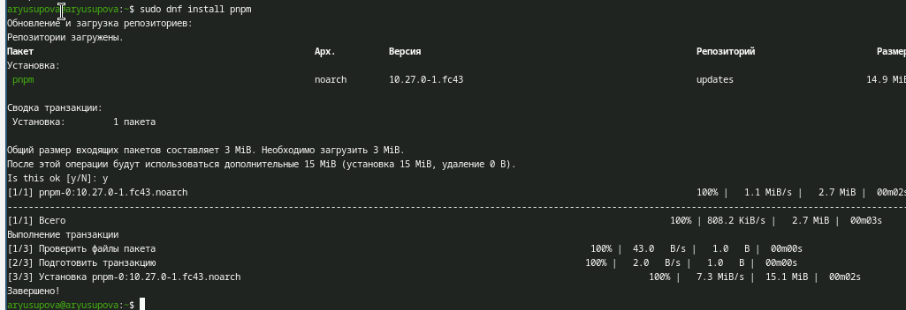
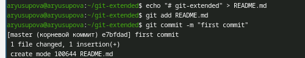
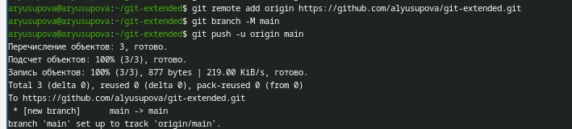
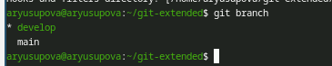
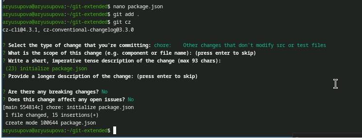
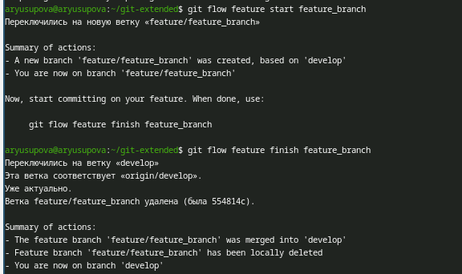
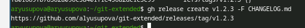

---
## Author
author:
  name: Юсупова Алина Руслановна
  affiliation:
    - name: Российский университет дружбы народов
      country: Российская Федерация
      postal-code: 117198
      city: Москва
      address: ул. Миклухо-Маклая, д. 6
lang: ru
format:
  pdf:
    documentclass: scrartcl
    latex-engine: xelatex
    mainfont: "Liberation Serif"
    sansfont: "Liberation Sans"
    monofont: "Liberation Mono"
    include-in-header:
      text: |
        \usepackage{fontspec}
        \setmainfont{Liberation Serif}
        \setsansfont{Liberation Sans}
        \setmonofont{Liberation Mono}
  pptx:
    toc: false
## Title
title: Лабораторная работа №4
subtitle: Продвинутое использование git
license: CC BY
---

# Информация

## Докладчик
  * Юсупова Алина Руслановна
  * студентка NKAbd-06-25
  * Российский университет дружбы народов им. П. Лумумбы
  * [1032253510@rudn.ru](mailto:1032253510@rudn.ru)
  * <https://github.com/alyusupova>

# Цели и задачи работы

## Цель лабораторной работы

Получение навыков правильной работы с репозиториями git.

# Процесс выполнения лабораторной работы

## Установка Git Flow

Для управления ветками было установлено расширение Git Flow. Репозиторий Copr включён, пакет установлен.

{#fig:001 width=70% height=70%}

## Установка Node.js и pnpm

Node.js необходим для работы пакетного менеджера pnpm, который используется для установки Commitizen. После установки выполнена настройка окружения.

{#fig:002 width=70% height=70%}

## Установка pnpm

{#fig:003 width=70% height=70%}

## Настройка pnpm

{#fig:004 width=70% height=70%}

## Создание репозитория и первый push

Создан локальный репозиторий `git-extended`, добавлен файл `README.md`, выполнена привязка к удалённому репозиторию на GitHub и произведён первый push.

{#fig:005 width=70% height=70%}

## Инициализация Git Flow

С помощью команды `git flow init` созданы основные ветки `master` и `develop` с параметрами по умолчанию.

{#fig:006 width=70% height=70%}
{#fig:007 width=70% height=70%}
{#fig:008 width=70% height=70%}

## Отправка ветки develop

Ветка `develop` отправлена на сервер и настроена на отслеживание удалённой ветки.

{#fig:009 width=70% height=70%}
{#fig:010 width=70% height=70%}

## Настройка package.json и Commitizen

Создан файл `package.json` через `pnpm init`, отредактирован: добавлено описание, автор, лицензия, настроен Commitizen для конвенциональных коммитов.

{#fig:012 width=70% height=70%}

## 

Коммит выполнен с помощью `git cz`, что обеспечило соблюдение стандарта Conventional Commits.

{#fig:013 width=70% height=70%}
{#fig:014 width=70% height=70%}

## Создание первого релиза (v1.0.0)

Создана релизная ветка, сгенерирован `CHANGELOG.md` с помощью `standard-changelog`. Релиз завершён, тег создан вручную из-за ошибки автоматического создания.

{#fig:015 width=70% height=70%}

##

{#fig:016 width=70% height=70%}

##

Ветки и теги отправлены на GitHub, релиз опубликован через `gh release create`.

{#fig:017 width=70% height=70%}
{#fig:018 width=70% height=70%}

## Работа с feature-веткой

Создана feature-ветка, в неё добавлен файл `example.txt`, сделан коммит через `git cz`. После завершения ветка слита в `develop`.

{#fig:019 width=70% height=70%}

## Создание второго релиза (v1.2.3)

Аналогично первому релизу создана ветка `release/1.2.3`, обновлён `CHANGELOG.md`. При завершении снова возникла ошибка с тегом, но слияние прошло успешно. Релиз создан на GitHub.

{#fig:021 width=70% height=70%}

##

{#fig:021 width=70% height=70%}

# Выводы по проделанной работе

## Вывод

В ходе выполнения лабораторной работы были освоены основные приёмы работы с Git Flow:

- установка и настройка инструментов (Git Flow, Node.js, pnpm, Commitizen);
- инициализация репозитория с ветками `master` и `develop`;
- создание и завершение feature-веток;
- подготовка и публикация релизов с автоматической генерацией changelog;
- использование конвенциональных коммитов через Commitizen.
