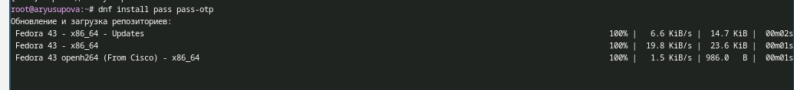
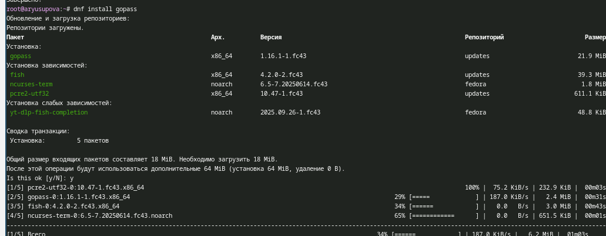
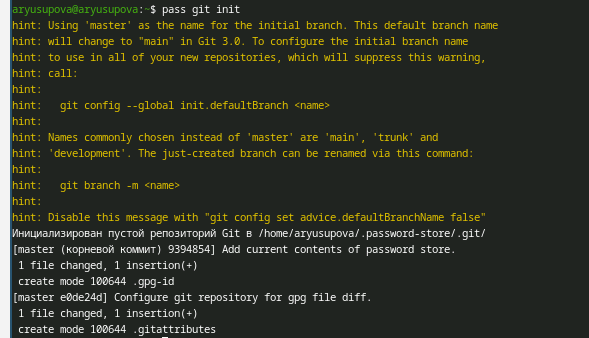
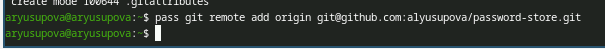
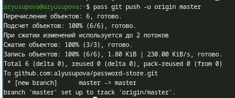
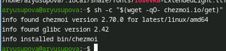
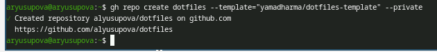

---
## Author
author:
  name: Юсупова Алина Руслановна
  affiliation:
    - name: Российский университет дружбы народов
      country: Российская Федерация
      postal-code: 117198
      city: Москва
      address: ул. Миклухо-Маклая, д. 6
lang: ru
format:
  pdf:
    documentclass: scrartcl
    latex-engine: xelatex
    mainfont: "Liberation Serif"
    sansfont: "Liberation Sans"
    monofont: "Liberation Mono"
    include-in-header:
      text: |
        \usepackage{fontspec}
        \setmainfont{Liberation Serif}
        \setsansfont{Liberation Sans}
        \setmonofont{Liberation Mono}
  pptx:
    toc: false
## Title
title: Лабораторная работа №5
subtitle: Настройка рабочей среды (менеджер паролей pass и управление конфигурациями chezmoi)
license: CC BY
---

# Информация

## Докладчик
  * Юсупова Алина Руслановна
  * студентка NKAbd-06-25
  * Российский университет дружбы народов им. П. Лумумбы
  * [1032253510@rudn.ru](mailto:1032253510@rudn.ru)
  * <https://github.com/alyusupova>

# Цели и задачи работы

## Цель лабораторной работы

Освоить работу с менеджером паролей pass, его синхронизацию через Git, интеграцию с браузером (browserpass), а также изучить возможности chezmoi для управления dotfiles на нескольких машинах.

## Задачи работы

- Установка и настройка менеджера паролей pass
- Создание и настройка GPG-ключей для шифрования
- Инициализация хранилища паролей
- Настройка синхронизации через Git и GitHub
- Освоение основных операций с паролями
- Интеграция pass с браузером через browserpass
- Установка и настройка chezmoi для управления dotfiles
- Создание репозитория для конфигурационных файлов
- Развёртывание конфигурации на нескольких машинах

# Процесс выполнения лабораторной работы

## Установка pass и проверка GPG-ключа

**Установка менеджера паролей pass и расширения pass-otp**

{#fig:001 width=70% height=70%}

##  

**Проверка наличия GPG-ключа для шифрования**

{#fig:002 width=70% height=70%}

## Инициализация хранилища и создание репозитория

**Инициализация хранилища pass с привязкой к email GPG-ключа**

{#fig:003 width=70% height=70%}

##

**Создание приватного репозитория на GitHub для синхронизации паролей**

{#fig:004 width=70% height=70%}

## Настройка Git-синхронизации

**Инициализация Git в локальном хранилище pass**

{#fig:005 width=70%}

##

**Подключение удалённого репозитория и отправка изменений**

{#fig:006 width=70% height=70%}

## Основные операции с паролями

**Добавление нового пароля, просмотр и генерация надёжного пароля**

{#fig:007 width=70%}

## Интеграция с браузером (browserpass)

**Установка расширения browserpass для Firefox/Chrome**

{#fig:008 width=70%}

##

**Установка native messaging хоста для связи браузера с хранилищем**

{#fig:009 width=70%}

## Установка шрифтов Iosevka

**При проблемах с установкой через dnf, шрифты установлены вручную из архивов**

{#fig:010 width=70%}

## Установка chezmoi

**Установка инструмента для управления dotfiles с официального сайта**

{#fig:011 width=70%}

## Создание репозитория для dotfiles

**Создание приватного репозитория на основе шаблона с помощью утилиты gh**

{#fig:012 width=70%}

## Имитация второго компьютера

**Была работа с имитацией второго компьютера, к сожалению, скрины не сохранились**

**Создание тестового окружения для проверки развёртывания конфигураций**

**Инициализация chezmoi на втором компьютере с использованием созданного репозитория**

**Проверка успешного применения всех конфигурационных файлов**

## Дополнительно: экспорт GPG-ключа

**Экспорт приватного GPG-ключа для использования на других машинах**

{#fig:016 width=70%}

# Выводы по проделанной работе

## Заключение

**Полученные навыки позволяют:**

- Эффективно управлять паролями с использованием шифрования GPG
- Синхронизировать зашифрованные данные между несколькими устройствами через Git
- Автоматически заполнять пароли в браузере с помощью browserpass
- Централизованно хранить и синхронизировать конфигурационные файлы (dotfiles)
- Быстро развёртывать рабочую среду на новых компьютерах

**Все поставленные задачи лабораторной работы выполнены полностью.**

---

