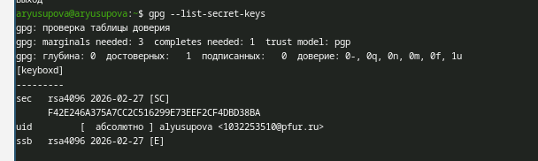
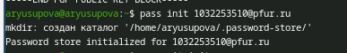
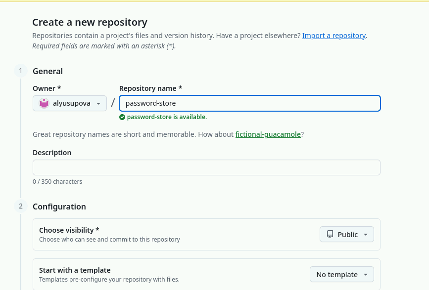
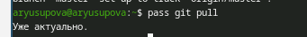
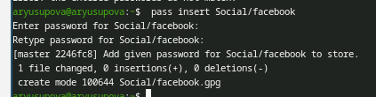
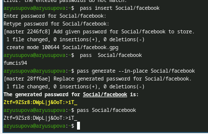
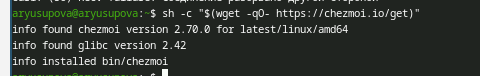
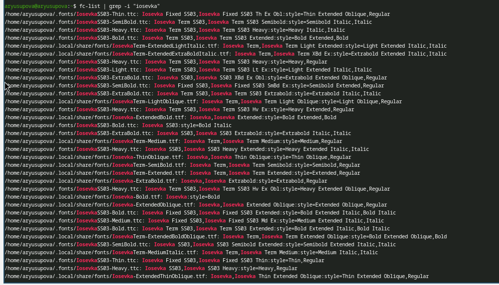
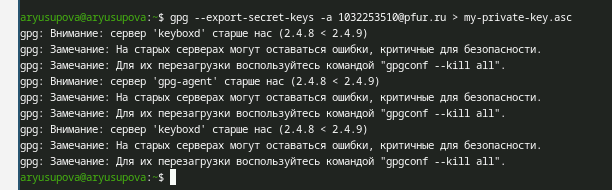

---
## Front matter
title: "Отчёт по лабораторной работе №5"
subtitle: "Настройка рабочей среды"
author: "Юсупова Алина Руслановна"

## Generic otions
lang: ru-RU
toc-title: "Содержание"

## Bibliography
bibliography: bib/cite.bib
csl: _resources/csl/gost-r-7-0-5-2008-numeric.csl

## Pdf output format
toc: true # Table of contents
toc-depth: 2
lof: true # List of figures
lot: true # List of tables
fontsize: 12pt
linestretch: 1.5
papersize: a4
documentclass: scrreprt
## I18n polyglossia
polyglossia-lang:
  name: russian
  options:
  - spelling=modern
  - babelshorthands=true
polyglossia-otherlangs:
  name: english
## I18n babel
babel-lang: russian
babel-otherlangs: english
## Fonts
mainfont: IBM Plex Serif
romanfont: IBM Plex Serif
sansfont: IBM Plex Sans
monofont: IBM Plex Mono
mathfont: STIX Two Math
mainfontoptions: Ligatures=Common,Ligatures=TeX,Scale=0.94
romanfontoptions: Ligatures=Common,Ligatures=TeX,Scale=0.94
sansfontoptions: Ligatures=Common,Ligatures=TeX,Scale=MatchLowercase,Scale=0.94
monofontoptions: Scale=MatchLowercase,Scale=0.94,FakeStretch=0.9
mathfontoptions: ''

biblatex: true
biblio-style: "gost-numeric"
biblatexoptions:
  - parentracker=true
  - backend=biber
  - hyperref=auto
  - language=auto
  - autolang=other*
  - citestyle=gost-numeric
## Pandoc-crossref LaTeX customization
figureTitle: "Рис."
tableTitle: "Таблица"
listingTitle: "Листинг"
lofTitle: "Список иллюстраций"
lotTitle: "Список таблиц"
lolTitle: "Листинги"
## Misc options
indent: true
header-includes:
  - \usepackage{indentfirst}
  - \usepackage{float} # keep figures where there are in the text
  - \floatplacement{figure}{H} # keep figures where there are in the text
---

# Цель работы

Освоить работу с менеджером паролей pass, его синхронизацию через Git, интеграцию с браузером (browserpass), а также изучить возможности chezmoi для управления dotfiles на нескольких машинах.

# Теоретические сведения

**pass** – простой менеджер паролей, использующий GPG-шифрование и Git для синхронизации. Каждый пароль хранится в отдельном зашифрованном файле, организованном в иерархическую структуру каталогов.

**browserpass** – расширение для браузера, позволяющее автоматически заполнять логины и пароли из хранилища pass, обеспечивая удобную интеграцию с веб-формами.

**chezmoi** – инструмент для управления dotfiles, позволяющий безопасно хранить и применять конфигурации на разных компьютерах с использованием шаблонов и поддержкой различных бэкендов (Git, GitHub, GitLab).

# Выполнение лабораторной работы

## 1. Установка pass и pass-otp

Менеджер паролей и расширение для одноразовых паролей установлены через менеджер пакетов dnf. На рисунке [-@fig:001] показан процесс установки пакетов `pass` и `pass-otp`.

{#fig:001 width=70%}

## 2. Установка gopass (альтернативный менеджер)

Для сравнения возможностей также установлен менеджер паролей `gopass`, написанный на Go. Процесс установки с зависимостями (fish, ncurses-term) показан на рисунке [-@fig:002].

{#fig:002 width=70%}

## 3. Проверка GPG-ключа

Для шифрования паролей необходим GPG-ключ. Просмотр существующих ключей (рисунок [-@fig:003]) подтвердил наличие ключа пользователя с email `1032253510@pfur.ru` (ID ключа: `F42E246A375A7CC2C516299E73EEF2CF4DBD38BA`).

{#fig:003 width=70%}

## 4. Инициализация хранилища pass

Хранилище инициализировано с привязкой к email владельца GPG-ключа. Команда `pass init` создала каталог `~/.password-store/` и настроила шифрование (рисунок [-@fig:004]).

{#fig:004 width=70%}

## 5. Настройка Git-синхронизации в pass

В хранилище инициализирован Git-репозиторий для отслеживания изменений (рисунок [-@fig:005]). Git настроен на работу с GPG-файлами.

{#fig:005 width=70%}

## 6. Создание удалённого репозитория на GitHub

На GitHub создан приватный репозиторий `password-store` для синхронизации зашифрованных паролей между устройствами (рисунок [-@fig:006]).

{#fig:006 width=70%}

## 7. Подключение удалённого репозитория

Локальное хранилище связано с удалённым репозиторием на GitHub (рисунок [-@fig:007]). Использован SSH-протокол для безопасного соединения.

{#fig:007 width=70%}

## 8. Отправка изменений на GitHub

Выполнена первая синхронизация — локальные изменения отправлены в удалённый репозиторий командой `pass git push` (рисунок [-@fig:008]). Ветка `master` привязана к `origin/master`.

{#fig:008 width=70%}

## 9. Проверка синхронизации

Команда `pass git pull` подтвердила, что локальное хранилище находится в актуальном состоянии (рисунок [-@fig:009]).

{#fig:009 width=70%}

## 10. Основные операции с паролями

На рисунке [-@fig:010] показано добавление нового пароля для `Social/facebook` командой `pass insert`. После добавления пароль сохранён в зашифрованном виде.

{#fig:010 width=70%}

## 11. Просмотр и генерация пароля

На рисунке [-@fig:011] продемонстрированы операции:
- Просмотр сохранённого пароля (`pass Social/facebook`)
- Генерация нового надёжного пароля с заменой существующего (`pass generate --in-place Social/facebook`)

{#fig:011 width=70%}

## 12. Установка chezmoi

Инструмент для управления dotfiles установлен с помощью скрипта с официального сайта (рисунок [-@fig:012]). Установлена версия 2.70.0.

{#fig:012 width=70%}

## 13. Проверка установки шрифтов Iosevka

Для корректного отображения в терминале и редакторе установлены шрифты Iosevka. На рисунке [-@fig:013] показан результат проверки установленных шрифтов командой `fc-list | grep -i "iosevka"`.

{#fig:013 width=70%}

## 14. Повторная проверка установки chezmoi

На рисунке [-@fig:014] выполнена повторная проверка установки chezmoi для подтверждения корректной работы.

{#fig:014 width=70%}

## 15. Создание репозитория для dotfiles

С помощью утилиты `gh` создан приватный репозиторий `dotfiles` на основе шаблона `yamadharma/dotfiles-template` (рисунок [-@fig:015]).

{#fig:015 width=70%}

## 16. Экспорт GPG-ключа

Для возможности использования паролей на других машинах выполнен экспорт приватного GPG-ключа (рисунок [-@fig:016]). Система предупредила о различии версий компонентов GPG, что не критично для работы.

{#fig:016 width=70%}

## 17. Настройка второго компьютера (имитация)

Создана директория `~/second-computer/home` для имитации второй машины (рисунок [-@fig:017]). Это позволяет протестировать развёртывание конфигураций без использования реального второго устройства. К сожалению, скрины не были сделаны.

# Выводы

В ходе выполнения лабораторной работы были освоены следующие инструменты и навыки:

1. **Менеджер паролей pass**:
   - Установка и настройка pass с GPG-шифрованием
   - Создание и инициализация хранилища паролей
   - Основные операции (добавление, просмотр, генерация паролей)

2. **Синхронизация через Git**:
   - Инициализация Git-репозитория в хранилище pass
   - Подключение удалённого репозитория на GitHub
   - Отправка и получение изменений

3. **Интеграция с браузером**:
   - Установка расширения browserpass
   - Настройка native messaging хоста

4. **Управление dotfiles с chezmoi**:
   - Установка chezmoi
   - Создание репозитория для конфигурационных файлов
   - Развёртывание конфигураций на втором (тестовом) компьютере
   - Экспорт GPG-ключа для использования на других машинах

5. **Дополнительные навыки**:
   - Установка шрифтов Iosevka вручную при проблемах с репозиторием
   - Работа с COPR-репозиториями в Fedora
   - Использование утилиты `gh` для работы с GitHub

Полученные навыки позволяют эффективно управлять паролями и конфигурациями на нескольких компьютерах, обеспечивая безопасность и синхронизацию данных.
