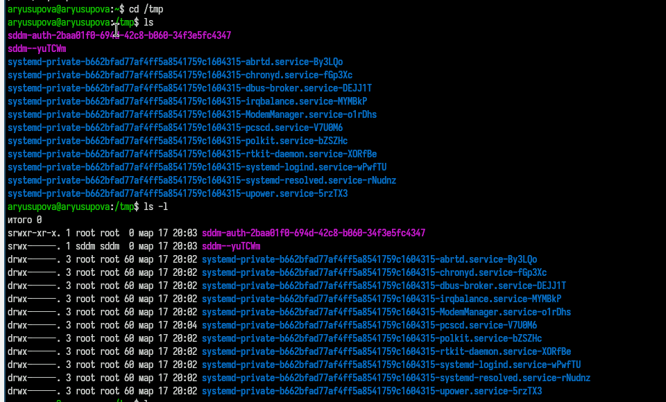
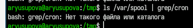
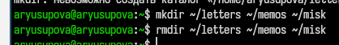
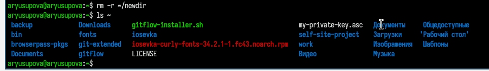
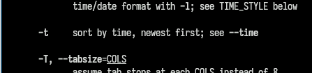
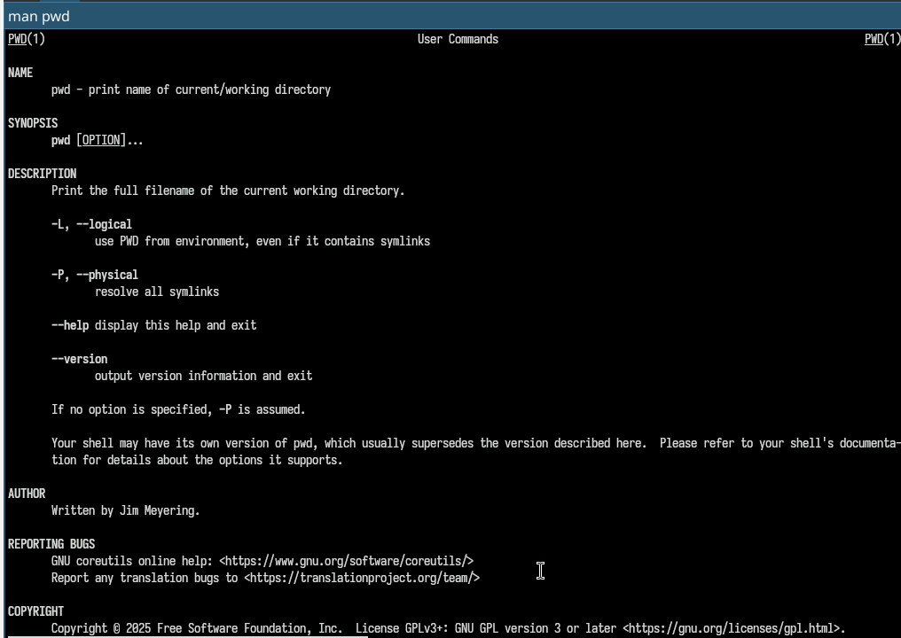
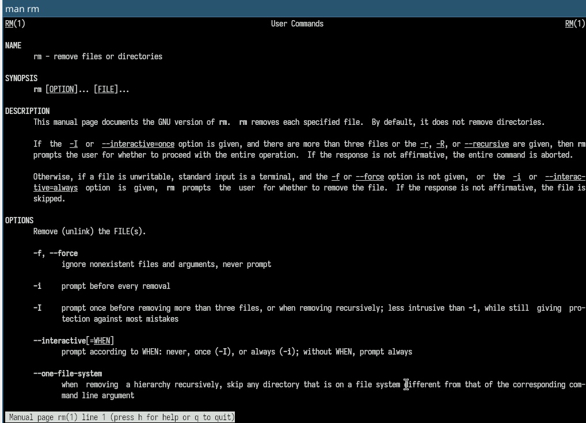
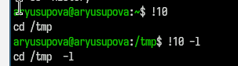

---
## Author
author:
  name: Юсупова Алина Руслановна
  affiliation:
    - name: Российский университет дружбы народов
      country: Российская Федерация
      postal-code: 117198
      city: Москва
      address: ул. Миклухо-Маклая, д. 6
lang: ru
format:
  pdf:
    documentclass: scrartcl
    latex-engine: xelatex
    mainfont: "Liberation Serif"
    sansfont: "Liberation Sans"
    monofont: "Liberation Mono"
    include-in-header:
      text: |
        \usepackage{fontspec}
        \setmainfont{Liberation Serif}
        \setsansfont{Liberation Sans}
        \setmonofont{Liberation Mono}
  pptx:
    toc: false
## Title
title: Лабораторная работа №6
subtitle: Основы интерфейса командной строки
license: CC BY
---

# Информация

## Докладчик
  * Юсупова Алина Руслановна
  * студентка NKAbd-06-25
  * Российский университет дружбы народов им. П. Лумумбы
  * [1032253510@rudn.ru](mailto:1032253510@rudn.ru)
  * <https://github.com/alyusupova>

# Цели и задачи работы

## Цель лабораторной работы

Приобретение практических навыков взаимодействия пользователя с системой посредством командной строки

## Задачи лабораторной работы

1. Определить имя и путь домашнего каталога
2. Изучить команду `ls` и её опции
3. Выполнить действия с каталогами (создание, удаление, перемещение)
4. Получить дополнительные сведения при помощи справки по командам
5. Изучить команду `history` и модификацию команд

# Процесс выполнения лабораторной работы

## Имя и путь к домашнему каталогу

Для определения абсолютного пути к домашнему каталогу использована команда `pwd`. На рис. 1 представлен результат выполнения команды в домашнем каталоге пользователя. Домашний каталог имеет путь `/home/aryusupova`.

{#fig:001 width=70%}

## Опции команды ls

Для просмотра содержимого каталога `/tmp` использована команда `ls`. На рис. 2 представлен базовый вывод содержимого каталога временных файлов.

{#fig:002 width=70%}

##

Для получения расширенной информации применены опции `-l` (детальный вывод с правами доступа, владельцем, размером) и `-a` (отображение скрытых файлов). Результат представлен на рис. 3.

{#fig:003 width=70%}

##

Опция `-F` добавляет символы, указывающие тип объектов: `/` для каталогов, `*` для исполняемых файлов. Результат применения опции представлен на рис. 4.

{#fig:004 width=70%}

## Каталог /var/spool

Для просмотра содержимого каталога `/var/spool` без перехода в него использована команда `ls /var/spool`. Вывод представлен на рис. 5. В данном каталоге содержатся файлы, ожидающие обработки различными службами системы.

{#fig:005 width=70%}

## Домашний каталог

Возврат в домашний каталог выполнен командой `cd` без аргументов. Текущий каталог проверен командой `pwd`. Детальный список содержимого получен с помощью `ls -l`. На рис. 6 видно, что владельцем всех объектов является пользователь `aryusupova`.

{#fig:006 width=70%}

## Работа с каталогами

Командой `mkdir newdir` создан новый каталог. Результат выполнения команды представлен на рис. 7.

{#fig:007 width=70%}

##

Внутри каталога `newdir` командой `mkdir newdir/morefun` создан подкаталог. На рис. 8 показан результат выполнения команды.

{#fig:008 width=70%}

##

Команда `mkdir letters memos` создаёт два каталога. Удаление выполнено командой `rmdir letters memos`. После удаления каталоги отсутствуют в списке (рис. 9).

{#fig:009 width=70%}

##

Попытка удалить каталог `newdir` командой `rm newdir` приводит к ошибке, так как `rm` без опции `-r` не удаляет каталоги. Сообщение об ошибке представлено на рис. 10.

{#fig:010 width=70%}

##

Для корректного удаления сначала удалён подкаталог `morefun` командой `rmdir newdir/morefun`. После проверки пустоты каталога `newdir` выполнен возврат в домашний каталог и удаление `newdir` командой `rmdir newdir`. На рис. 11 показан результат удаления.

{#fig:011 width=70%}

## Опции команды ls

Для сортировки файлов по времени последнего изменения использована комбинация опций `-lt`. Результат выполнения команды `ls -lt` в домашнем каталоге показан на рис. 12. Самые новые файлы отображаются первыми.

{#fig:012 width=70%}

## Справка по командам

Для получения справочной информации использованы команды `man` и `help`. На рис. 13 представлен фрагмент вывода встроенной справки по команде `cd` (`help cd`).

{#fig:013 width=70%}

##

На рис. 14 представлен фрагмент руководства по команде `mkdir` (`man mkdir`), позволяющий ознакомиться с доступными опциями.

{#fig:014 width=70%}

##

На рис. 15 представлен фрагмент руководства по команде `rm` (`man rm`), содержащий информацию об опциях удаления файлов и каталогов.

{#fig:015 width=70%}

## Модификация и исполнение нескольких команд

Команда `history` выводит список ранее выполненных команд. На рис. 16 показан пример модификации команды из истории: строка с номером 194 (`ls -l`) изменена на `ls -a` с помощью конструкции `194:s/-l/-a/`. Результат выполнения модифицированной команды также отображён.

{#fig:016 width=70%}

# Выводы по проделанной работе

## Выводы

В ходе выполнения лабораторной работы были приобретены практические навыки взаимодействия пользователя с системой посредством командной строки. Освоены следующие навыки:

- Определение текущего каталога с помощью команды `pwd`
- Навигация по файловой системе с использованием `cd`
- Просмотр содержимого каталогов с различными опциями команды `ls`

##

- Создание и удаление каталогов с помощью `mkdir` и `rmdir`
- Получение справочной информации через `man` и `help`
- Работа с историей команд и модификация ранее выполненных команд

Полученные навыки являются основой для эффективной работы в операционной системе Linux через командный интерфейс.
