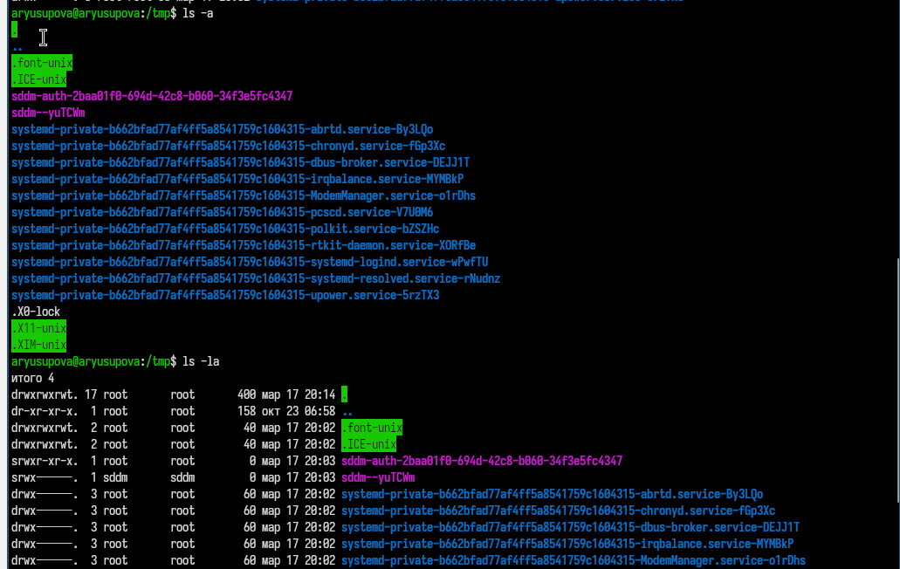
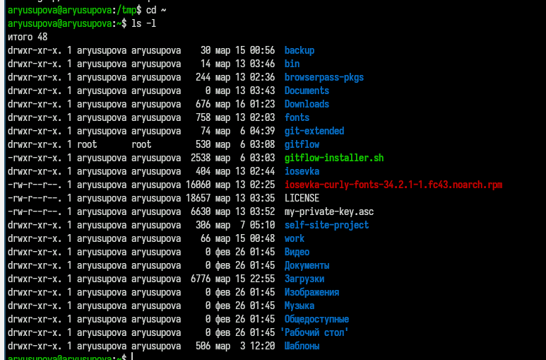
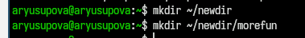
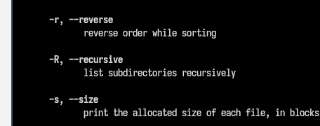
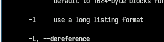
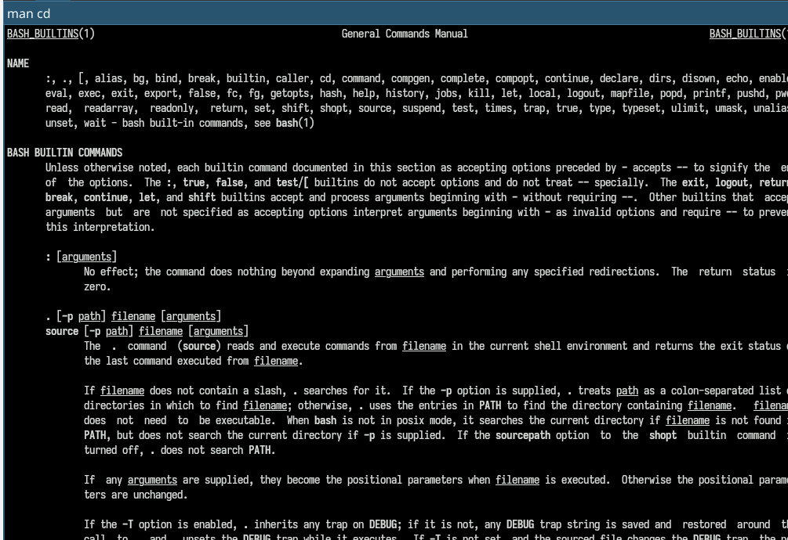
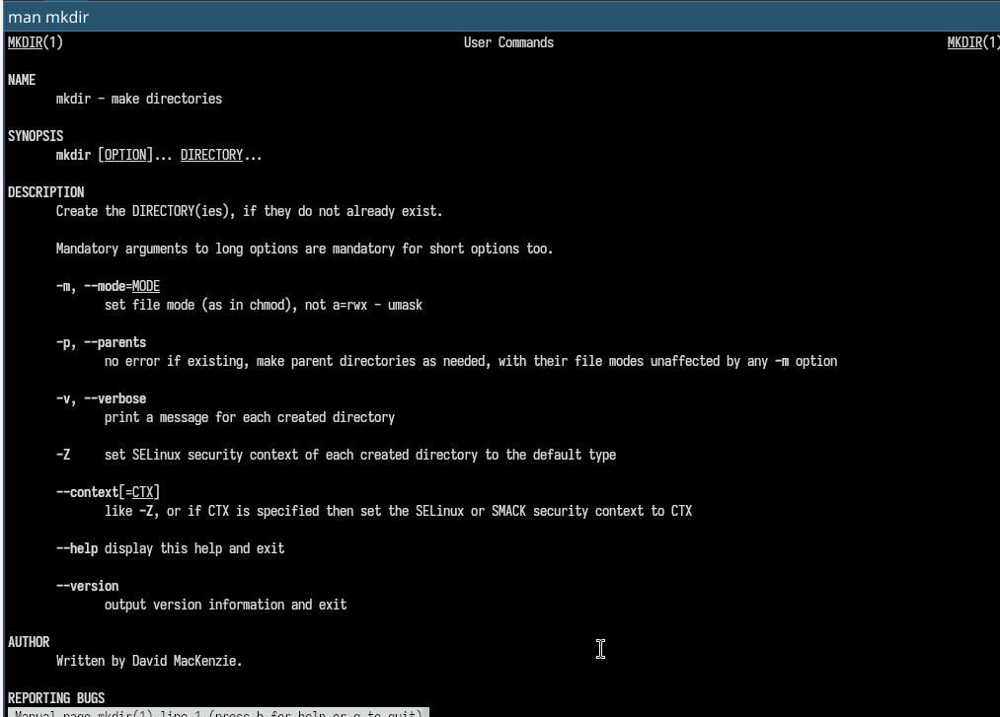
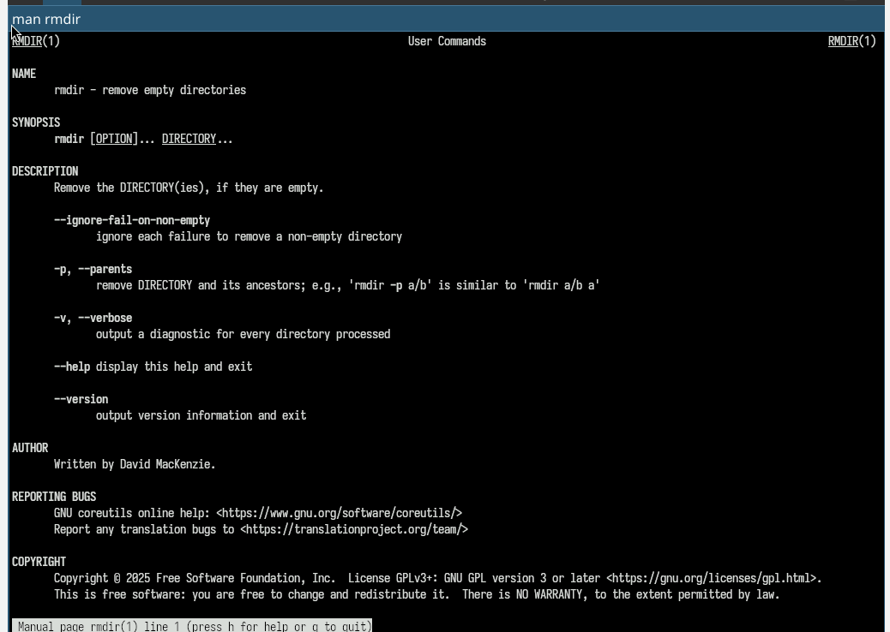
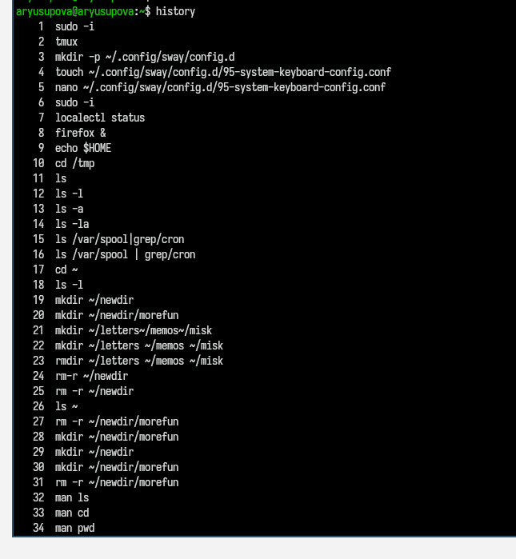

---
## Front matter
title: "Отчёт по лабораторной работе №6"
subtitle: "Основы интерфейса командной строки"
author: "Юсупова Алина Руслановна"

## Generic otions
lang: ru-RU
toc-title: "Содержание"

## Bibliography
bibliography: bib/cite.bib
csl: _resources/csl/gost-r-7-0-5-2008-numeric.csl

## Pdf output format
toc: true # Table of contents
toc-depth: 2
lof: true # List of figures
lot: true # List of tables
fontsize: 12pt
linestretch: 1.5
papersize: a4
documentclass: scrreprt
## I18n polyglossia
polyglossia-lang:
  name: russian
  options:
  - spelling=modern
  - babelshorthands=true
polyglossia-otherlangs:
  name: english
## I18n babel
babel-lang: russian
babel-otherlangs: english
## Fonts
mainfont: IBM Plex Serif
romanfont: IBM Plex Serif
sansfont: IBM Plex Sans
monofont: IBM Plex Mono
mathfont: STIX Two Math
mainfontoptions: Ligatures=Common,Ligatures=TeX,Scale=0.94
romanfontoptions: Ligatures=Common,Ligatures=TeX,Scale=0.94
sansfontoptions: Ligatures=Common,Ligatures=TeX,Scale=MatchLowercase,Scale=0.94
monofontoptions: Scale=MatchLowercase,Scale=0.94,FakeStretch=0.9
mathfontoptions: ''

biblatex: true
biblio-style: "gost-numeric"
biblatexoptions:
  - parentracker=true
  - backend=biber
  - hyperref=auto
  - language=auto
  - autolang=other*
  - citestyle=gost-numeric
## Pandoc-crossref LaTeX customization
figureTitle: "Рис."
tableTitle: "Таблица"
listingTitle: "Листинг"
lofTitle: "Список иллюстраций"
lotTitle: "Список таблиц"
lolTitle: "Листинги"
## Misc options
indent: true
header-includes:
  - \usepackage{indentfirst}
  - \usepackage{float} # keep figures where there are in the text
  - \floatplacement{figure}{H} # keep figures where there are in the text
---

# Цель работы

Приобретение практических навыков взаимодействия пользователя с системой посредством командной строки, а также освоение основных приёмов работы с файловой системой и управлением процессами в операционной системе Linux.

# Теоретические сведения

В операционных системах семейства Linux взаимодействие пользователя с системой реализуется через командную строку с использованием интерпретаторов команд (shell). Основные команды позволяют навигировать по файловой системе, управлять файлами и каталогами, получать справочную информацию и работать с историей выполненных команд. В работе используются следующие базовые команды:

- `pwd` — вывод текущего рабочего каталога;
- `cd` — смена текущего каталога;
- `ls` — просмотр содержимого каталога;
- `mkdir` — создание каталогов;
- `rmdir` и `rm` — удаление каталогов и файлов;
- `man` — вывод справочной информации;
- `history` — просмотр истории команд.

# Выполнение лабораторной работы

## 1. Определение полного имени домашнего каталога

Для определения абсолютного пути к домашнему каталогу использована команда `pwd`. Результат выполнения представлен на рис. 1. Домашний каталог пользователя имеет путь `/home/aryusupova`.

{#fig:001 width=70%}

## 2. Работа с каталогом временных файлов

2.1. Переход в каталог `/tmp` выполнен командой `cd /tmp`.

2.2. Просмотр содержимого каталога `/tmp` осуществлён с помощью команды `ls`. На рис. 2 приведён базовый вывод.

{#fig:002 width=70%}

Для получения расширенной информации использованы опции `-l` (детальный вывод) и `-a` (отображение скрытых файлов). Результат показан на рис. 3.

{#fig:003 width=70%}

Опция `-F` добавляет символы, указывающие тип объектов: `/` для каталогов, `*` для исполняемых файлов. Результат применения опции представлен на рис. 4.

{#fig:004 width=70%}

2.3. Для просмотра содержимого каталога `/var/log` без перехода в него использована команда `ls /var/log`. Вывод представлен на рис. 5.

{#fig:005 width=70%}

2.4. Возврат в домашний каталог выполнен командой `cd` без аргументов. Текущий каталог проверен командой `pwd`. Детальный список содержимого получен с помощью `ls -l`. Владельцем всех объектов является пользователь `aryusupova`.

{#fig:006 width=70%}

## 3. Создание и удаление каталогов

3.1. Командой `mkdir project` создан новый каталог.

{#fig:007 width=70%}

3.2. Внутри каталога `project` командой `mkdir project/docs` создан подкаталог.

{#fig:008 width=70%}

3.3. Команда `mkdir archive backup` создаёт два каталога. Удаление выполнено командой `rmdir archive backup`. После удаления каталоги отсутствуют в списке.

{#fig:009 width=70%}

3.4. Попытка удалить каталог `project` командой `rm project` приводит к ошибке, так как `rm` без опции `-r` не удаляет каталоги.

{#fig:010 width=70%}

3.5. Для корректного удаления сначала удалён подкаталог `docs` командой `rmdir project/docs`. После проверки пустоты каталога `project` выполнен возврат в домашний каталог и удаление `project` командой `rmdir project`.

{#fig:011 width=70%}

## 4. Изучение справочной информации с помощью man

С помощью команды `man ls` изучены опции для рекурсивного просмотра содержимого каталогов. Опция `-R` позволяет выводить содержимое всех подкаталогов. Фрагмент справочной информации представлен на рис. 12.

{#fig:012 width=70%}

## 5. Сортировка списка файлов по времени изменения

Для сортировки файлов по времени последнего изменения использована комбинация опций `-lt`. Результат выполнения команды `ls -lt` в домашнем каталоге показан на рис. 13. Самые новые файлы отображаются первыми.

{#fig:013 width=70%}

## 6. Изучение справочной информации о командах

Для получения встроенной справки использована команда `help`, для внешних — `man`. На рис. 14 показан фрагмент вывода `help echo`, на рис. 15 — `man cp`, на рис. 16 — `man mv`. Эти команды позволяют ознакомиться с синтаксисом и доступными опциями.

{#fig:014 width=70%}

{#fig:015 width=70%}

{#fig:016 width=70%}

## 7. Работа с историей команд

Команда `history` выводит список ранее выполненных команд. Пример модификации команды из истории: строка с номером 213 (`ls -l`) изменена на `ls -a` с помощью конструкции `213:s/-l/-a/`. Результат выполнения модифицированной команды представлен на рис. 17.

{#fig:017 width=70%}

# Выводы

В ходе выполнения лабораторной работы были приобретены практические навыки работы с командной строкой в операционной системе Linux. Освоены основные команды для навигации по файловой системе, создания и удаления каталогов, получения справочной информации, а также приёмы работы с историей команд.

# Контрольные вопросы

1. Что такое командная строка? Ответ: текстовый интерфейс взаимодействия пользователя с системой

2. При помощи какой команды можно определить абсолютный путь текущего каталога? Приведите пример. Ответ: команда pwd, пример:

+ cd /var/www
+ pwd
+ /var/www/

3. При помощи какой команды и каких опций можно определить только тип файлов и их имена в текущем каталоге? Приведите примеры. 
  Ответ: команда ls с опцией -F.

4. Каким образом отобразить информацию о скрытых файлах? Приведите примерыю. Ответ: ls -a — показывает все файлы, включая скрытые (начинающиеся с точки). Пример: ls -a → .bashrc .profile.
  

5. При помощи каких команд можно удалить файл и каталог? Можно ли это сделать одной и той же командой? Ответ: С помощью команды rm можно удалить как отдельный файл так и целый каталог, в случае каталога необходимо указать опцию -r.

6.  Каким образом можно вывести информацию о последних выполненных пользователем командах? работы? Ответ: команда history — выводит список последних выполненных команд.

7. Как воспользоваться историей команд для их модифицированного выполнения? Приведите примеры. Ответ: Модификация команды из истории: !номер:s/старое/новое/. Пример: !3:s/ls/ll/ заменит в команде №3 "ls" на "ll" и выполнит.

8. Приведите примеры запуска нескольких команд в одной строке. Ответ: Несколько команд в строке: через ; (последовательно) или && (при успехе). Пример: cd /tmp; ls -l.

9. Дайте определение и приведите примера символов экранирования. Ответ: Экранирование — отмена специального значения символа с помощью \. Пример: echo \$HOME выведет $HOME, а не значение переменной.

10.  Охарактеризуйте вывод информации на экран после выполнения команды ls с опцией. Ответ: ls -l выводит: тип файла, права доступа, число ссылок, владельца, группу, размер, дату, имя. Пример: -rw-r--r-- 1 user group 1024 Mar 13 10:00 file.txt.

11.  Что такое относительный путь к файлу? Приведите примеры использования относительного и абсолютного пути при выполнении какой-либо команды. Ответ: относительный путь - путь к тому или иному файлу или директории относительной текущей рабочей директории, пример: папка /www/ в директории /var/ абсолютный путь: /var/www/ относительный путь(если рабочая директория - /var/): /www/

12.  Как получить информацию об интересующей вас команде? Ответ: можно попробовать найти информацию по использованию с помощью утилиты man, или попробовать ввести опцию --help.

13.  Какая клавиша или комбинация клавиш служит для автоматического дополнения вводимых команд? Ответ: клавиша Tab.
