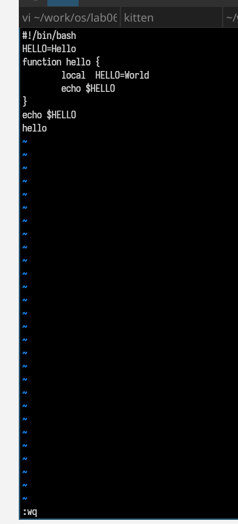
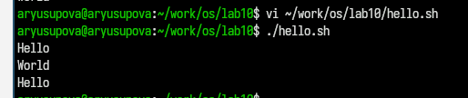

---
## Author
author:
  name: Юсупова Алина Руслановна
  affiliation:
    - name: Российский университет дружбы народов
      country: Российская Федерация
      postal-code: 117198
      city: Москва
      address: ул. Миклухо-Маклая, д. 6
lang: ru
format:
  pdf:
    documentclass: scrartcl
    latex-engine: xelatex
    mainfont: "Liberation Serif"
    sansfont: "Liberation Sans"
    monofont: "Liberation Mono"
    include-in-header:
      text: |
        \usepackage{fontspec}
        \setmainfont{Liberation Serif}
        \setsansfont{Liberation Sans}
        \setmonofont{Liberation Mono}
  pptx:
    toc: false
## Title
title: Лабораторная работа №10
subtitle: Текстовой редактор vi
license: CC BY

---

# Информация

## Докладчик
  * Юсупова Алина Руслановна
  * студентка NKAbd-06-25
  * Российский университет дружбы народов им. П. Лумумбы
  * [1032253510@rudn.ru](mailto:1032253510@rudn.ru)
  * <https://github.com/alyusupova>

# Цель работы

Освоение основных возможностей текстового редактора vi. Приобретение навыков практической работы по созданию и редактированию файлов с использованием команд vi.

# Выполнение лабораторной работы

## 1. Создание нового файла с использованием vi

### 1.1. Подготовка рабочего каталога

Создан каталог для лабораторной работы и запускаем файл hello.sh:

{#fig:001 width=70%}

##
 
### 1.2. Создание файла hello.sh

Запущен редактор vi для создания файла:

{#fig:002 width=70%}

##
 
### 1.3. Ввод текста скрипта

Нажата клавиша i для перехода в режим вставки и введен следующий текст:

{#fig:003 width=70%}

##
 
### 1.4. Сохранение файла

Выполнены некоторые действия:

{#fig:004 width=70%}

##
 
### 1.5. Установка прав на выполнение
Файлу установлены права на выполнение:

{#fig:005 width=70%}

## 2. Редактирование существующего файла

### 2.1. Открытие файла для редактирования

Проверка выполнения скрипта:

{#fig:006 width=70%}

## Выводы:

В ходе лабораторной работы освоены основные возможности текстового редактора vi:

 1. Создание и редактирование файлов: 
 
 2. Навыки работы с тремя режимами редактора vi
 
 3. Основные команды редактирования: Вставка, удаление, замена текста
 
 4. Навигация по файлу: Перемещение курсора, переход в начало/конец файла
 
 5. Сохранение и выход: Команды сохранения изменений и выхода из редактора
 
 6. Работа с Bash-скриптами: Создание и редактирование исполняемых скриптов
 
 7. Редактор vi, несмотря на свою первоначальную сложность, является мощным инструментом для работы с 
 текстом в UNIX/Linux средах и широко используется системными администраторами и разработчиками.
 

