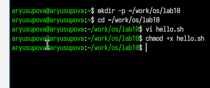
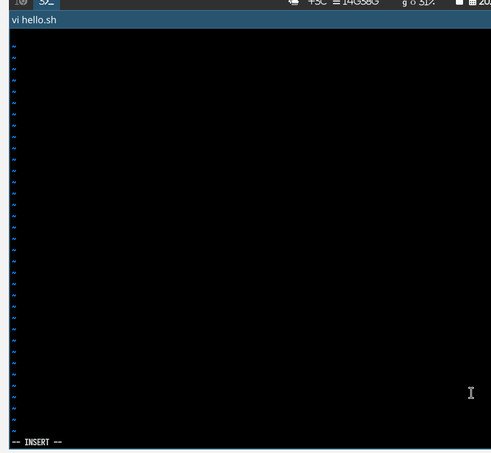
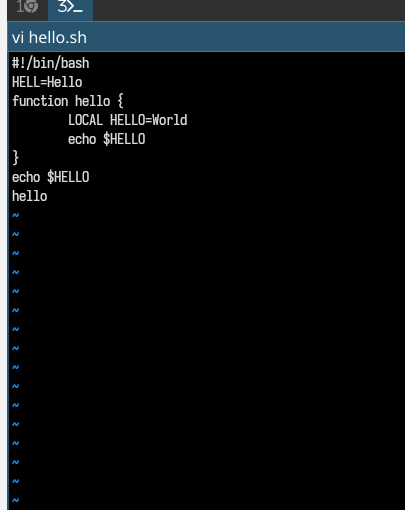
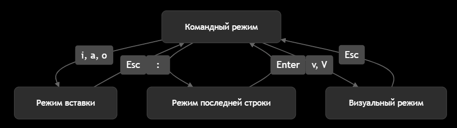

---
## Front matter
title: "Отчёт по лабораторной работе №10"
subtitle: "Текстовой редактор vi"
author: "Юсупова Алина Руслановна"

## Generic otions
lang: ru-RU
toc-title: "Содержание"

## Bibliography
bibliography: bib/cite.bib
csl: _resources/csl/gost-r-7-0-5-2008-numeric.csl

## Pdf output format
toc: true # Table of contents
toc-depth: 2
lof: true # List of figures
lot: true # List of tables
fontsize: 12pt
linestretch: 1.5
papersize: a4
documentclass: scrreprt
## I18n polyglossia
polyglossia-lang:
  name: russian
  options:
  - spelling=modern
  - babelshorthands=true
polyglossia-otherlangs:
  name: english
## I18n babel
babel-lang: russian
babel-otherlangs: english
## Fonts
mainfont: IBM Plex Serif
romanfont: IBM Plex Serif
sansfont: IBM Plex Sans
monofont: IBM Plex Mono
mathfont: STIX Two Math
mainfontoptions: Ligatures=Common,Ligatures=TeX,Scale=0.94
romanfontoptions: Ligatures=Common,Ligatures=TeX,Scale=0.94
sansfontoptions: Ligatures=Common,Ligatures=TeX,Scale=MatchLowercase,Scale=0.94
monofontoptions: Scale=MatchLowercase,Scale=0.94,FakeStretch=0.9
mathfontoptions: ''

biblatex: true
biblio-style: "gost-numeric"
biblatexoptions:
  - parentracker=true
  - backend=biber
  - hyperref=auto
  - language=auto
  - autolang=other*
  - citestyle=gost-numeric
## Pandoc-crossref LaTeX customization
figureTitle: "Рис."
tableTitle: "Таблица"
listingTitle: "Листинг"
lofTitle: "Список иллюстраций"
lotTitle: "Список таблиц"
lolTitle: "Листинги"
## Misc options
indent: true
header-includes:
  - \usepackage{indentfirst}
  - \usepackage{float} # keep figures where there are in the text
  - \floatplacement{figure}{H} # keep figures where there are in the text
---
# Цель работы

Освоение основных возможностей текстового редактора vi. Приобретение навыков практической работы по созданию и редактированию файлов с использованием команд vi.

# Теоретические сведения

Текстовый редактор vi (visual editor) — стандартный текстовый редактор в UNIX/Linux системах. Он имеет три основных режима работы:

1. **Командный режим** — для выполнения команд редактора
2. **Режим вставки** — для ввода текста
3. **Режим последней строки** — для ввода расширенных команд

# Выполнение лабораторной работы

## 1. Создание нового файла с использованием vi

### 1.1. Подготовка рабочего каталога

Создан каталог для лабораторной работы и запускаем файл hello.sh:

{#fig:001 width=70%}

### 1.2. Создание файла hello.sh

Запущен редактор vi для создания файла:

{#fig:002 width=70%}

### 1.3. Ввод текста скрипта

Нажата клавиша i для перехода в режим вставки и введен следующий текст:

#!/bin/bash

HELL=Hello

function hello {

    LOCAL HELLO=World

    echo $HELLO
}

echo $HELLO

hello

{#fig:003 width=70%}

### 1.4. Сохранение файла

Выполнены следующие действия:

1. Нажата клавиша Esc для перехода в командный режим

2. Нажата : для перехода в режим последней строки

3. Введена команда wq (write and quit) для сохранения и выхода

4. Нажата клавиша Enter

{#fig:004 width=70%}

### 1.5. Установка прав на выполнение
Файлу установлены права на выполнение:

#### chmod +x hello.sh

{#fig:005 width=70%}

## 2. Редактирование существующего файла

### 2.1. Открытие файла для редактирования
Файл открыт для редактирования:

#### vi ~/work/os/lab06/hello.sh

### 2.2. Исправление переменной HELL

Выполнены следующие действия:

 1. Курсор установлен в конец слова HELL во второй строке

 2. Переход в режим вставки (i)

 3. Замена HELL на HELLO

 4. Возврат в командный режим (Esc)

### 2.3. Исправление ключевого слова LOCAL

Выполнены следующие действия:

 1. Курсор установлен на четвертую строку
 2. Удалено слово LOCAL (команда dw)
 3. Переход в режим вставки (i)
 4. Введено слово local
 5. Возврат в командный режим (Esc)

### 2.4. Добавление новой строки

Выполнены следующие действия:

 1. Курсор установлен на последней строке файла

 2. Переход в режим вставки (o - новая строка ниже)

 3. Введен текст: echo $HELLO

 4. Возврат в командный режим (Esc)

### 2.5. Удаление и отмена изменений

Выполнены следующие действия:

 1. Удалена последняя строка (команда dd)

 2. Отменено последнее изменение (команда u)

 3. Сохранение изменений и выход (:wq)

 4. Результаты выполнения

 5. Листинг итогового скрипта hello.sh

#!/bin/bash

HELLO=Hello

function hello {
    
    local HELLO=World
    
    echo $HELLO
    
}

echo $HELLO

hello

echo $HELLO

Проверка выполнения скрипта:

{#fig:006 width=70%}

## Выводы:

В ходе лабораторной работы освоены основные возможности текстового редактора vi:
 1. Создание и редактирование файлов: 
 2. Навыки работы с тремя режимами редактора vi
 3. Основные команды редактирования: Вставка, удаление, замена текста
 4. Навигация по файлу: Перемещение курсора, переход в начало/конец файла
 5. Сохранение и выход: Команды сохранения изменений и выхода из редактора
 6. Работа с Bash-скриптами: Создание и редактирование исполняемых скриптов
 7. Редактор vi, несмотря на свою первоначальную сложность, является мощным инструментом для работы с текстом в UNIX/Linux средах и широко используется системными администраторами и разработчиками.

## Ответы на контрольные вопросы

1. Дайте краткую характеристику режимам работы редактора vi

Три основных режима:

 Командный режим — для выполнения команд редактора (перемещение, удаление, копирование)

 Режим вставки — для ввода и редактирования текста

 Режим последней строки — для ввода расшиенных команд (сохранение, поиск, замена)

2. Как выйти из редактора, не сохраняя произведённые изменения?

Команда :q! в режиме последней строки.

3. Назовите и дайте краткую характеристику командам позиционирования

 - h, j, k, l — перемещение влево, вниз, вверх, вправо

 - 0 — начало строки

 - $ — конец строки

 - gg — начало файла

 - G — конец файла

 - w — следующее слово

 - b — предыдущее слово

4. Что для редактора vi является словом?

Слово — последовательность букв, цифр и подчеркиваний, либо последовательность других символов, разделенная пробелами, табуляциями или знаками препинания.

5. Каким образом из любого места редактируемого файла перейти в начало (конец) файла?

Начало файла: gg или 1G

Конец файла: G

6. Назовите и дайте краткую характеристику основным группам команд редактирования

Основные группы:

- Вставка: i, a, o, O

- Удаление: x, dd, dw, d$

- Копирование/вырезание: yy, yw, p, P

- Замена: r, R, cw, cc

7. Необходимо заполнить строку символами $. Каковы ваши действия?

 - Перейти в начало строки (0)
 - Перейти в режим вставки (i)
 - Ввести нужное количество символов $
 - Вернуться в командный режим (Esc)

8. Как отменить некорректное действие, связанное с процессом редактирования?

Команда u отменяет последнее изменение.

9. Назовите и дайте характеристику основным группам команд режима последней строки

Основные команды:

 - :w — сохранить файл
 - :q — выйти из редактора
 - :wq — сохранить и выйти
 - :q! — выйти без сохранения
 - :set nu — показать номера строк
 - :/pattern — поиск pattern
 - :s/old/new — замена old на new

10. Как определить, не перемещая курсора, позицию, в которой заканчивается строка?

Команда :$ показывает последнюю строку файла.

11. Выполните анализ опций редактора vi (сколько их, как узнать их назначение и т.д.)

Опции редактора можно просмотреть командой :set all. Основные опции:

 - nu — номера строк
 - ic — игнорирование регистра при поиске
 - wrap — перенос строк
 - list — отображение невидимых символов

12. Как определить режим работы редактора vi?

По строке состояния внизу экрана:

 - -- INSERT -- — режим вставки
 - -- VISUAL -- — визуальный режим
 - -- REPLACE -- — режим замены
 - Пустая строка — командный режим

13. Постройте граф взаимосвязи режимов работы редактора vi

{#fig:007 width=70%}

Объяснение графа:

 - Из командного режима можно перейти в любой другой режим
 - Из любого режима можно вернуться в командный режим нажатием Esc
 - Режим последней строки активируется из командного режима
Визуальный режим используется для выделения текста

